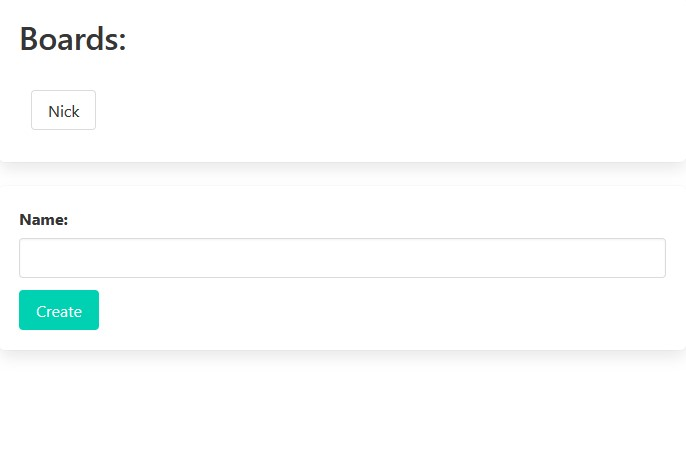
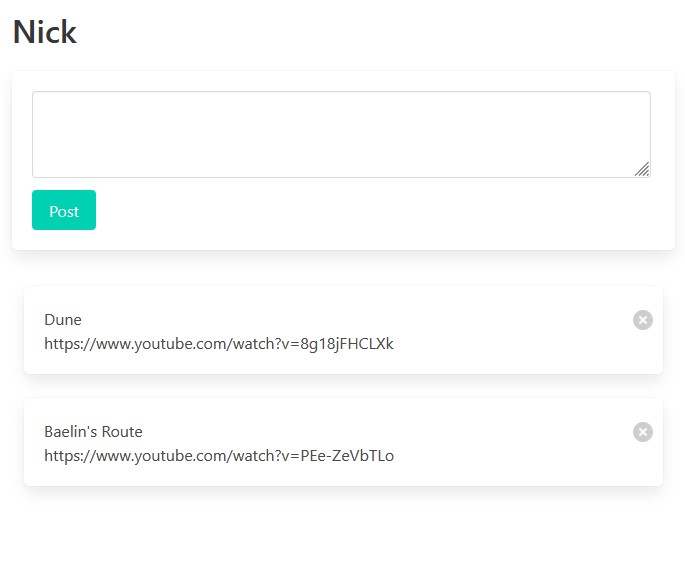

# Intro

Pasteboard is a global copy-paste board for all the devices in your home. Do you love the magic copy-paste that works from your iPhone to your Macbook and wish that it worked with all your other devices? That's what Pasteboard solves.

Now you can simply spin up a Pasteboard container on your laptop or home server, pin the URL to your browser bookmarks and you'll always have somewhere you can drop a YouTube links, Reddit posts, or other URLs so that all the devices in your home or office can immediately access it.

Create as many boards as you want. Categorize them by topic or by person:



 Anyone with access to the paste board can now post and access posts on the available boards:



## Why wouldn't I just use Discord, Messenger, WhatsApp, or Skype for this?

Do you really want to install a bloated app on every device you own, sign it in, and set it all up?

Every new device you buy, you'll have to:

* Make sure that app is compatible with your device
* Make sure the app is available on whatever "app store" it uses
* Download the app
* Install the app
* Log into the app
  * This gets tricky if you use a password manager, now you have to go through the rigamarole of getting the password over to your new device too
* Find your message to yourself
* Open the link you wanted to share
* Done

By contrast, using pasteboard is as simple as:

* Open pasteboard in any browser
* Click on the board you want
* See the link you wanted to share with your new device
* Done

Pasteboard is a lot simpler, and it ALWAYS works with ANY device that has a browser in your home or office.

# Getting Started

## Docker

```
docker run -d -p 27017:27017 --restart always --name mongo mongo:5.0.6
```

## Example `.env` file

```
PORT=7000
MONGO_URL=mongodb://localhost:27017
```

## NPM

```
npm install
npm run start
```

Then you can head to `http://localhost:7000` to test the app.

# Deploying

## Docker Build

```
docker build -t nickfunk/pasteboard:<TAG> -f Dockerfile .
```

## Run It

```
docker run -d -p 7000:7000 -e MONGO_URL=mongodb://host.docker.internal:27017 --name pb nickfunk/pasteboard:<TAG>
```

## Example `docker-compose.yml`

```
version: "3"
services:
  pasteboard:
    image: nickfunk/pasteboard:<TAG>
    container_name: pasteboard
    ports:
      - 7000:7000
    environment:
      PORT: 7000
      MONGO_URL: mongodb://<YOUR_IP>:27017/pasteboard
      MONGO_DB: pasteboard
    restart: unless-stopped
  mongo:
    image: mongo:5.0.6
    container_name: mongo-pb
    ports:
      - 27017:27017
    restart: unless-stopped
```